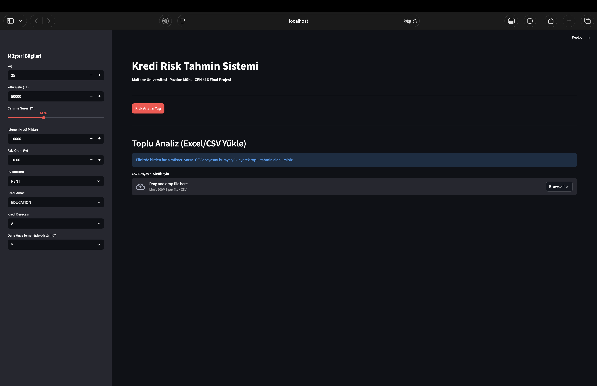

# Credit Risk Analysis & Reporting System

This project is a comprehensive **Machine Learning** solution designed to predict credit repayment risk. Unlike standard classification models, this system features a **Multi-Model AI Engine**, an **Interactive Dashboard**, and **Automated PDF Reporting**, making it a complete software product for financial institutions.

## Course & Student Information

| Detail | Information |
|--------|-------------|
| **University** | Maltepe University |
| **Department** | Software Engineering (3rd Year) |
| **Course Code** | CEN 416 01 - Data Mining |
| **Instructor** | Asst. Prof. Dr. Onder TOMBUS |
| **Student Name** | Yusuf Talha KAMILOGLU |
| **Student ID** | 220706006 |

---

## Key Features (Why this project is unique?)

This project implements advanced software engineering principles alongside data mining techniques:

1.  **Multi-Model AI Architecture:** Users can switch between 4 different algorithms in real-time to compare results:
    * **XGBoost** (High Performance)
    * **Random Forest** (Robust & Stable)
    * **Decision Tree** (Interpretable)
    * **Logistic Regression** (Baseline)
2.  **Automated PDF Reporting:** Generates official credit risk reports containing customer details and analysis results with a single click.
3.  **Comparative Statistical Analysis:** Explains **why** a loan is rejected by comparing the applicant against successful customers (e.g., "Income is 20% lower than average").
4.  **Batch Processing (CSV Upload):** Supports bulk analysis for bank managers to process thousands of applicants via file upload.

---

## Project Structure

* **setup_models.py**: A utility script that trains all 4 Machine Learning models and saves them as .pkl files.
* **app.py**: The source code for the Streamlit Web Application.
* **project.ipynb**: The main Data Mining notebook (EDA, Preprocessing, Visualization).
* **.pkl files**: Serialized models (xgboost_model.pkl, random_forest_model.pkl, etc.) for instant inference.
* **credit_risk_dataset.csv**: The dataset used for training and calculating statistical averages.

---

## Data & Methodology

**Dataset:** Credit Risk Dataset (Source: Kaggle)
* **Target:** loan_status (0: Approved, 1: Risk/Default)
* **Key Features:** Age, Income, Employment Length, Loan Amount, Interest Rate, Home Ownership, etc.

**Preprocessing (Chapter 2):**
* Outlier Detection (Removed unrealistic ages > 100).
* Imputation (Filled missing employment years and interest rates).
* One-Hot Encoding (Converted categorical data to numeric).

**Modeling (Chapter 3):**
* **Algorithms:** Decision Tree, Random Forest, XGBoost, Logistic Regression.
* **Performance:** Up to **93% Accuracy** (with Random Forest/XGBoost).
* **Validation:** 80-20 Train-Test Split validation.

---

## Installation & Usage

To run the full dashboard locally:

### 1. Clone the Repository
```bash
git clone https://github.com/yousurff/credit-risk-analysis.git
cd credit-risk-analysis
```

### 2. Install Dependencies
```bash
pip install pandas numpy matplotlib seaborn scikit-learn streamlit joblib xgboost fpdf
```

### 3. Run the Application
```bash
streamlit run app.py
```

If that doesn't work, try "python3 -m streamlit run app.py".

*The web interface will open automatically in your browser.*



---
*This project was prepared as the Final Assignment for CEN 416.*
